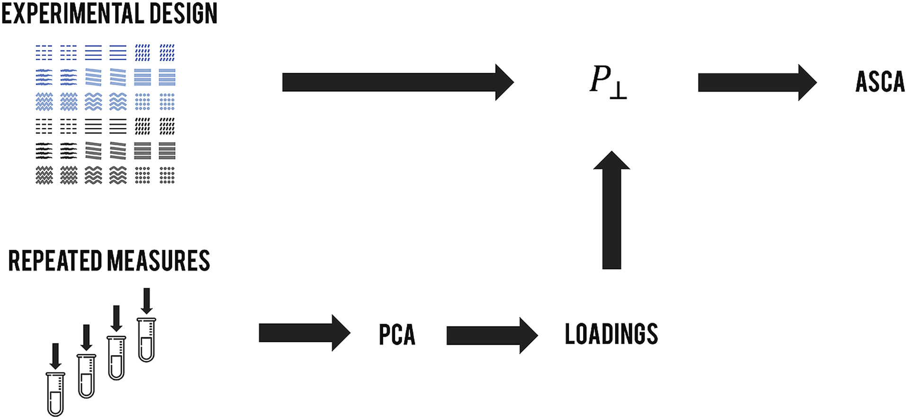

  
  
  
  
  
  
  

  
  <h2 align="center">REP-ASCA in Python</h2>
  
Reduction of repeatability error for Analysis of variance-Simultaneous Component Analysis (REP-ASCA) is an analysis of variance method for Multivariate data. This method is based on ASCA. 

  <a href="https://github.com/RYCKEWAERT/repasca">View project</a>
  ·
  <a href="https://github.com/RYCKEWAERT/repasca/issues">Report Bug</a>
  ·
  <a href="https://github.com/RYCKEWAERT/repasca/issues">Request Feature</a>
  <h1></h1>

# REP-ASCA
Reduction of repeatability error for Analysis of variance-Simultaneous Component Analysis (REP-ASCA) is an analysis of variance method for Multivariate data. This method is based on ASCA. 

**References:**

About the method: 

- Reduction of repeatability error for Analysis of variance-Simultaneous Component Analysis (REP-ASCA): Application to NIR spectroscopy on coffee sample
_Maxime Ryckewaert, Nathalie Gorretta, Fabienne Henriot, Federico Marini, Jean-Michel Roger_
December 2019- Analytica Chimica Acta 1101 DOI: [10.1016/j.aca.2019.12.024](https://doi.org/10.1016/j.aca.2019.12.024)

See applications: 
- Potential of high-spectral resolution for field phenotyping in plant breeding: application to maize under water stress
_Maxime Ryckewaert, Nathalie Gorretta, Fabienne Henriot, Daniel Moura, Daphné Héran, Ryad Bendoula, Jean-Michel Roger_

- A generic workflow combining deep learning and chemometrics for processing close-range spectral images to detect drought stress in Arabidopsis thaliana to support digital phenotyping
_Puneet Mishra, Roy Sadeh, Maxime Ryckewaert, Ehud Bino, Gerrit Polder, Martin P Boer, Douglas N Rutledge, Ittai Herrmann_
[10.1016/j.chemolab.2021.104373](https://doi.org/10.1016/j.chemolab.2021.104373)
