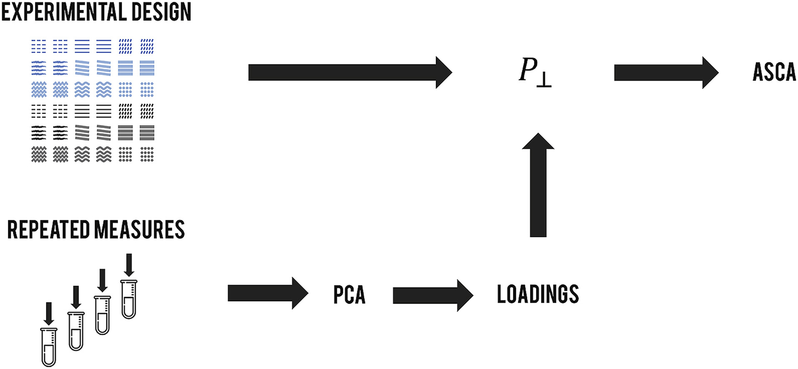
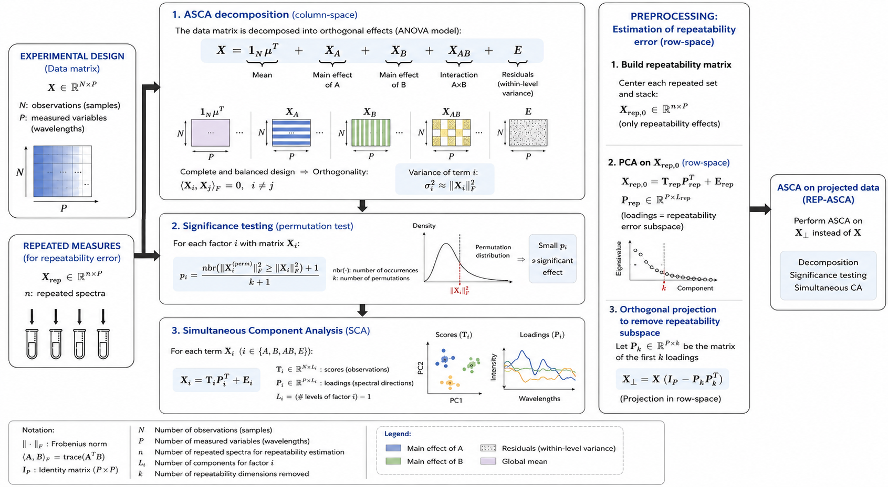

# REP-ASCA-Python

<a name="readme-top"></a>

<p align="center">
  <a href="https://github.com/RYCKEWAERT/REP-ASCA-Python/graphs/contributors"></a>
  <a href="https://github.com/RYCKEWAERT/REP-ASCA-Python/network/members"></a>
  <a href="https://github.com/RYCKEWAERT/REP-ASCA-Python/issues"></a>
  <a href="https://github.com/RYCKEWAERT/REP-ASCA-Python/blob/main/LICENSE"></a>
  <a href="https://github.com/RYCKEWAERT/REP-ASCA-Python/pulls"></a>
  <a href="https://github.com/RYCKEWAERT/REP-ASCA-Python/stargazers"></a>
  <a href="https://github.com/RYCKEWAERT/REP-ASCA-Python/watchers"></a>
</p>

<div align="center">
  
  <h2 align="center">REP-ASCA-Python</h2>
  <p align="center">A Python implementation of REP-ASCA — Reduction of Repeatability Error for ANOVA Simultaneous Component Analysis on multivariate spectral data</p>
  <a href="https://github.com/RYCKEWAERT/REP-ASCA-Python">View project</a>
  ·
  <a href="https://github.com/RYCKEWAERT/REP-ASCA-Python/issues">Report Bug</a>
  ·
  <a href="https://github.com/RYCKEWAERT/REP-ASCA-Python/issues">Request Feature</a>
</div>

---

## Overview

**REP-ASCA** (Reduction of Repeatability Error for Analysis of Variance — Simultaneous Component Analysis) is a multivariate statistical method that extends ASCA to account for repeatability errors inherent in instrumental measurements. When a sample is measured multiple times with the same instrument (e.g. a NIR spectrometer), small but systematic variations appear across replicates. Left uncorrected, this repeatability noise inflates residuals and can mask the true effects of experimental factors.

REP-ASCA estimates the spectral subspace associated with this noise from a set of replicate measurements, projects it out of the main dataset, and then runs standard ASCA on the cleaned data. The result is a more sensitive decomposition of variance into interpretable experimental effects (main effects, interactions) with rigorous permutation-based significance testing.

This repository provides a full Python implementation (`librairies/repasca.py`) and a step-by-step tutorial notebook (`main.ipynb`) that runs on the provided example dataset (`data/data.mat`).

---

## Method

The figure below summarises the full REP-ASCA pipeline as presented in the original paper.

<p align="center">
  
</p>

The pipeline consists of three interconnected stages:

**1. ASCA decomposition (column-space)**

The data matrix **X** (N observations x P variables) is decomposed according to a factorial ANOVA model. For a two-factor balanced design:

```
X = overall_mean + effect_A + effect_B + effect_AB + residuals
```

Each effect matrix is obtained by projecting X onto the corresponding design matrix. The variance explained by each factor is computed and used to build SCA (Simultaneous Component Analysis) models — score and loading matrices restricted to the variance of that factor alone.

**2. Preprocessing — estimating and removing repeatability error (REP-ASCA)**

A subset of samples is measured repeatedly to build the repeatability matrix **X_rep**. The within-sample residual matrix (WS = X_rep minus the between-sample projection) captures the pure measurement noise. PCA on WS yields the error loadings **L_err**: the k spectral directions that carry repeatability variance.

The corrected matrix is obtained by projecting those k directions out of X:

```
X_bar = X - X @ L_err[:, :k].T @ L_err[:, :k]
```

The explained-variance profile is evaluated for k = 0, 1, …, klimit to guide the choice of k (trade-off between noise reduction and signal preservation).

**3. Significance testing and SCA on corrected data**

ASCA is run on **X_bar** with permutation tests (default: 1000 permutations) to assess the statistical significance of each factor. SCA decomposes each significant effect into interpretable scores and loadings.

---

## Key Features

- Full Python implementation of REP-ASCA, ASCA, SCA and permutation testing
- Step-by-step tutorial notebook with annotated figures at each stage
- Visualisation of raw spectra, repeatability residuals, error loadings, explained variance, SCA scores and loadings, permutation test distributions, and before/after correction comparison
- Works on any multivariate dataset stored in `.mat` format with the expected variables
- Self-contained virtual environment with pinned dependencies (`requirements.txt`)

---

## Quick Start

```bash
# 1. Clone the repository
git clone https://github.com/RYCKEWAERT/REP-ASCA-Python.git
cd REP-ASCA-Python

# 2. Create and activate a virtual environment
python -m venv .venv
.venv\Scripts\activate          # Windows
# source .venv/bin/activate     # macOS / Linux

# 3. Install dependencies
pip install -r requirements.txt

# 4. Launch JupyterLab
jupyter lab

# 5. Open main.ipynb and run cells in order
```

---

## Repository Structure

```
REP-ASCA-Python/
├── data/
│   └── data.mat                  # Example dataset (spectral matrix + design)
├── images/
│   ├── repasca.png               # Project logo
│   └── schema_sum-up_paper.png   # Method pipeline figure
├── librairies/
│   └── repasca.py                # Core implementation (rep_asca, rep_asca_applied, asca, ...)
├── main.ipynb                    # Step-by-step tutorial notebook
├── requirements.txt              # Pinned Python dependencies
└── README.md
```

---

## Data Format

The tutorial notebook loads `data/data.mat` via SciPy. The file must contain the following variables (names are case-sensitive):

| Variable | Shape | Description |
|----------|-------|-------------|
| `X` | (n_samples, n_vars) | Main spectral matrix |
| `d` | (n_samples, 2) | Design matrix — column 0: Factor A, column 1: Factor B |
| `X_rep` | (n_rep, n_vars) | Replicate measurements for repeatability estimation |
| `d_rep` | (n_rep, 1) | Sample identifier for each replicate row |
| `lambda` | (1, n_vars) | Wavelength or variable axis |
| `palette` | array | Optional colour palette for figures |

The notebook prints variable shapes after loading so you can verify the data is correctly structured.

---

## Notebook Workflow

| Section | Description |
|---------|-------------|
| 1 | Import libraries |
| 2 | Set analysis parameters (`KLIMIT`, `K_REMOVE`, `N_PERM`) |
| 3 | Load `data.mat` and inspect variable shapes |
| 4 | Explore the experimental design (factor levels, balance) |
| 5 | Visualise raw spectra coloured by Factor A and Factor B |
| 6 | Visualise repeatability variation (replicate bundles, within-sample residuals) |
| 7 | Compute REP components with `rep_asca()` |
| 8 | Inspect REP error loadings and heatmap |
| 9 | Choose k from the explained-variance plot and table |
| 10 | Apply correction and run ASCA with `rep_asca_applied()` |
| 11 | SCA scores plots (Factor A, Factor B) |
| 12 | SCA loadings plots |
| 13 | Permutation test distributions and p-values |
| 14 | Before vs. after correction comparison for Factor A |
| 15 | Final summary report |

---

## How to Cite

If you use this implementation in your work, please cite the original paper:

> Ryckewaert, M., Gorretta, N., Henriot, F., Marini, F., & Roger, J.-M. (2020).
> Reduction of repeatability error for Analysis of variance-Simultaneous Component Analysis (REP-ASCA):
> Application to NIR spectroscopy on coffee samples.
> *Analytica Chimica Acta*, 1101, 22–30.
> https://doi.org/10.1016/j.aca.2019.12.024

BibTeX entry:

```bibtex
@article{ryckewaert2020repasca,
  title   = {Reduction of repeatability error for {Analysis of variance-Simultaneous Component Analysis} ({REP-ASCA}):
             Application to {NIR} spectroscopy on coffee samples},
  author  = {Ryckewaert, Maxime and Gorretta, Nathalie and Henriot, Florent and Marini, Federico and Roger, Jean-Michel},
  journal = {Analytica Chimica Acta},
  volume  = {1101},
  pages   = {22--30},
  year    = {2020},
  doi     = {10.1016/j.aca.2019.12.024}
}
```

The underlying ASCA methodology was introduced in:

> Smilde, A. K., Jansen, J. J., Hoefsloot, H. C. J., Lamers, R.-J. A. N., van der Greef, J., & Timmerman, M. E. (2005).
> ANOVA-simultaneous component analysis (ASCA): a new tool for analyzing designed metabolomics data.
> *Bioinformatics*, 21(13), 3043–3048.
> https://doi.org/10.1093/bioinformatics/bti476

---

## Papers Using REP-ASCA

The following published studies applied the REP-ASCA method:

- Ryckewaert, M., et al. (2020). *Reduction of repeatability error for REP-ASCA: application to NIR spectroscopy on coffee samples.* Analytica Chimica Acta, 1101.
  https://doi.org/10.1016/j.aca.2019.12.024 — **original paper**

- Ryckewaert, M., et al. *Potential of high-spectral resolution for field phenotyping in plant breeding: application to maize under water stress.* (in preparation / under review)

- Mishra, P., et al. (2021). *A generic workflow combining deep learning and chemometrics for processing close-range spectral images to detect drought stress in Arabidopsis thaliana.* Chemometrics and Intelligent Laboratory Systems, 217, 104373.
  https://doi.org/10.1016/j.chemolab.2021.104373

---

## License

This project is distributed under the terms of the included `LICENSE` file. See that file for details.

<p align="right">(<a href="#readme-top">back to top</a>)</p>
